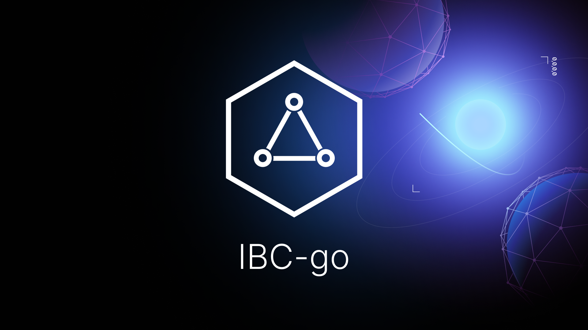

  <h1>ibc-go</h1>

  
  
  
  
  

  
  
  
    
    

The [Inter-Blockchain Communication protocol (IBC)](https://ibcprotocol.org/) allows blockchains to talk to each other. IBC handles transport across different sovereign blockchains. This end-to-end, connection-oriented, stateful protocol provides reliable, ordered, and authenticated communication between heterogeneous blockchains. This IBC implementation in Golang is built as a Cosmos SDK module.

## Roadmap

For an overview of upcoming changes to ibc-go take a look at the [roadmap](./docs/roadmap/roadmap.md).

This roadmap is also available as a [project board](https://github.com/orgs/cosmos/projects/7/views/25).

For the latest expected release timelines, please check [here](https://github.com/cosmos/ibc-go/wiki/Release-timeline).

For the latest information on the progress of the work or the decisions made that might influence the roadmap, please follow our [engineering updates](https://github.com/cosmos/ibc-go/wiki/Engineering-updates).

## Releases

The release lines currently supported are v2, v3, v4 and v5. 

Please refer to the [Stable Release Policy section of RELEASES.md](https://github.com/cosmos/ibc-go/blob/main/RELEASES.md#stable-release-policy) for more details.

Please refer to our [versioning guide](https://github.com/cosmos/ibc-go/blob/main/RELEASES.md) for more information on how to understand our release versioning.

## Ecosystem

Discover the applications, middleware and light clients developed by other awesome teams in the ecosystem:

In the table below
`app` refers to IBC application modules for custom use cases and
`middleware` refers to modules that wrap an IBC application enabling custom logic to be executed.

|Description|Repository|Type|
|----------|----------|----|
|An application that enables on chain querying of another IBC enabled chain utilizing `baseapp.Query`. Both chains must have implemented the query application and ICA (for queries requiring consensus).|[ICQ](https://github.com/strangelove-ventures/ibc-go/tree/feature/icq_implementation/modules/apps/icq)|`app`|
|An application that enables on chain querying of another IBC enabled chains state without the need for the chain being queried to implement the application.|[interchain-queries](https://github.com/ingenuity-build/interchain-queries)|`app`|
|An application that enables on chain querying of another IBC enabled chains state without the need for the chain being queried to implement the application. Similar to the interchain-queries application in the row above but without callbacks.|[query](https://github.com/defund-labs/defund/tree/main/x/query)|`app`|
|An application that enables cross chain NFT transfer.|[NFT Transfer (ICS 721)](https://github.com/bianjieai/nft-transfer)|`app`|
|Middleware enabling a packet to be sent to a destination chain via an intermediate chain, e.g. going from Juno to Osmosis via the Hub.|[packet-forward-middleware](https://github.com/strangelove-ventures/packet-forward-middleware)|`middleware`|
|Middleware enabling the recovery of tokens sent to unsupported addresses.|[recovery](https://github.com/evmos/evmos/tree/main/x/recovery)|`middleware`|
|Middleware that limits the in or out flow of an asset in a certain time period to minimise the risks of cross chain token transfers.|[IBC-rate-limiting](https://github.com/osmosis-labs/osmosis/pull/2339)|`middleware`|

## Support

We have active, helpful communities on Discord and Telegram.

For questions and support please use the `developers` channel in the [Cosmos Network Discord server](https://discord.com/channels/669268347736686612/1019978171367559208) or join the [IBC Gang Discord server](https://discord.gg/RdpdkaXKpZ). The issue list of this repo is exclusively for bug reports and feature requests.

To receive announcements of new releases or other technical updates, please join the [Telegram group that we administer](https://t.me/ibc_is_expansive).

## Contribution Guidelines & Requests for Maintainership

We have detailed documents for contributors wishing to [contribute code to ibc-go](https://github.com/cosmos/ibc-go/blob/main/CONTRIBUTING.md) or [submit a feature for maintainership](./MAINTAINERSHIP.md) in the `ibc-go` codebase. Please note that all maintainers of and contributors to the codebase are subject to the [Code of Conduct](https://github.com/cosmos/ibc-go/blob/main/CODE_OF_CONDUCT.md).

## Security

To report a security vulnerability, see our [bug bounty program](https://hackerone.com/cosmos).

## Contents of this repo

1. **[Core IBC Implementation](https://github.com/cosmos/ibc-go/tree/main/modules/core)**

    1.1 [ICS 02 Client](https://github.com/cosmos/ibc-go/tree/main/modules/core/02-client)

    1.2 [ICS 03 Connection](https://github.com/cosmos/ibc-go/tree/main/modules/core/03-connection)

    1.3 [ICS 04 Channel](https://github.com/cosmos/ibc-go/tree/main/modules/core/04-channel)

    1.4 [ICS 05 Port](https://github.com/cosmos/ibc-go/tree/main/modules/core/05-port)

    1.5 [ICS 23 Commitment](https://github.com/cosmos/ibc-go/tree/main/modules/core/23-commitment/types)

    1.6 [ICS 24 Host](https://github.com/cosmos/ibc-go/tree/main/modules/core/24-host)

2. **Applications**

    2.1 [ICS 20 Fungible Token Transfers](https://github.com/cosmos/ibc-go/tree/main/modules/apps/transfer)

    2.2 [ICS 27 Interchain Accounts](https://github.com/cosmos/ibc-go/tree/main/modules/apps/27-interchain-accounts)

3. **Light Clients**

    3.1 [ICS 07 Tendermint](https://github.com/cosmos/ibc-go/tree/main/modules/light-clients/07-tendermint)

    3.2 [ICS 06 Solo Machine](https://github.com/cosmos/ibc-go/tree/main/modules/light-clients/06-solomachine)

## Documentation and Resources

- [IBC Website](https://ibcprotocol.org/)
- [IBC Specification](https://github.com/cosmos/ibc)
- [Documentation](https://ibc.cosmos.network/main/ibc/overview.html)
