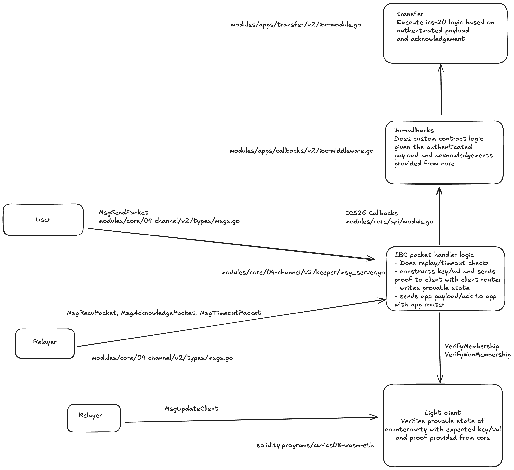

:::note Synopsis
Learn how to implement IBC v2 applications
:::

To build an IBC v2 application the following steps are required:

1. [Implement the `IBCModule` interface](#implement-the-ibcmodule-interface)
2. [Bind Ports](#bind-ports)
3. [Implement the IBCModule Keeper](#implement-the-ibcmodule-keeper)
4. [Implement application payload and success acknowledgement](#packets-and-payloads)
5. [Set and Seal the IBC Router](#routing)

Highlighted improvements for app developers with IBC v2:

- No need to support channel handshake callbacks
- Flexibility on upgrading application versioning, no need to use channel upgradability to renegotiate an application version, simply support the application version on both sides of the connection.
- Flexibility to choose your desired encoding type.  

## Implement the `IBCModule` interface

The Cosmos SDK expects all IBC modules to implement the [`IBCModule`
interface](https://github.com/cosmos/ibc-go/blob/main/modules/core/api/module.go#L9-L53). This interface contains all of the callbacks IBC expects modules to implement. Note that for IBC v2, an application developer no longer needs to implement callbacks for the channel handshake. Note that this interface is distinct from the [porttypes.IBCModule interface][porttypes.IBCModule] used for IBC Classic. 

```go
// IBCModule implements the application interface given the keeper.
// The implementation of the IBCModule interface could for example be in a file called ibc_module.go,
// but ultimately file structure is up to the developer
type IBCModule struct {
  keeper keeper.Keeper
}
```

Additionally, in the `module.go` file, add the following line:

```go
var (
  _ module.AppModule      = AppModule{}
  _ module.AppModuleBasic = AppModuleBasic{}
  // Add this line
  _ porttypes.IBCModule   = IBCModule{}
)
```

### Packet callbacks

IBC expects modules to implement callbacks for handling the packet lifecycle, as defined in the `IBCModule` interface.

With IBC v2, modules are not directly connected. Instead a pair of clients are connected and register the counterparty clientID. Packets are routed to the relevant application module by the portID registered in the Router. Relayers send packets between the routers/packet handlers on each chain. 



Briefly, a successful packet flow works as follows:

1. A user sends a message to the IBC packet handler
2. The IBC packet handler validates the message, creates the packet and stores the commitment and returns the packet sequence number. The [`Payload`](https://github.com/cosmos/ibc-go/blob/fe25b216359fab71b3228461b05dbcdb1a554158/proto/ibc/core/channel/v2/packet.proto#L26-L38), which contains application specific data, is routed to the relevant application.
3. If the counterparty writes an acknowledgement of the packet then the sending chain will process the acknowledgement.
4. If the packet is not successfully received before the timeout, then the sending chain processes the packet's timeout.

#### Sending packets

[`MsgSendPacket`](https://github.com/cosmos/ibc-go/blob/main/modules/core/04-channel/v2/types/tx.pb.go#L69-L75) is sent by a user to the [channel v2 message server](https://github.com/cosmos/ibc-go/blob/main/modules/core/04-channel/v2/keeper/msg_server.go), which calls `ChannelKeeperV2.SendPacket`. This validates the message, creates the packet, stores the commitment and returns the packet sequence number. The application must specify its own payload which is used by the application and sent with `MsgSendPacket`.

An application developer needs to implement the custom logic the application executes when a packet is sent.  

```go

// OnSendPacket logic
func (im *IBCModule) OnSendPacket(
  ctx sdk.Context, 
  sourceChannel string, 
  destinationChannel string, 
  sequence uint64, 
  payload channeltypesv2.Payload, 
  signer sdk.AccAddress) error {

// implement any validation

// implement payload decoding and validation

// call the relevant keeper method for state changes as a result of application logic

// emit events or telemetry data

return nil
}

```

#### Receiving packets

To handle receiving packets, the module must implement the `OnRecvPacket` callback. An application module should validate and confirm support for the given version and encoding method used as there is greater flexibility in IBC v2 to support a range of versions and encoding methods.
The `OnRecvPacket` callback is invoked by the IBC module after the packet has been proven to be valid and correctly processed by the IBC
keepers. 
Thus, the `OnRecvPacket` callback only needs to worry about making the appropriate state
changes given the packet data without worrying about whether the packet is valid or not. 

Modules may return to the IBC handler an acknowledgement which implements the `Acknowledgement` interface.
The IBC handler will then commit this acknowledgement of the packet so that a relayer may relay the
acknowledgement back to the sender module.

The state changes that occurr during this callback could be:

- the packet processing was successful as indicated by the `PacketStatus_Success` and an `Acknowledgement()` will be written
- if the packet processing was unsuccessful as indicated by the `PacketStatus_Failure` and an `ackErr` will be written

Note that with IBC v2 the error acknowledgements are standardised and cannot be customised. 

```go
func (im IBCModule) OnRecvPacket(
  ctx sdk.Context, sourceChannel string, destinationChannel string, sequence uint64, payload channeltypesv2.Payload, relayer sdk.AccAddress) channeltypesv2.RecvPacketResult {

  // do application state changes based on payload and return the result
  // state changes should be written via the `RecvPacketResult`

  return recvResult
}
```

#### Acknowledging packets

After a module writes an acknowledgement, a relayer can relay back the acknowledgement to the sender module. The sender module can
then process the acknowledgement using the `OnAcknowledgementPacket` callback. The contents of the
acknowledgement is entirely up to the application developer.

IBC will pass in the acknowledgements as `[]byte` to this callback. The callback
is responsible for decoding the acknowledgement and processing it. The acknowledgement is serialised and deserialised using JSON.

```go
func (im IBCModule) OnAcknowledgementPacket(
  ctx sdk.Context, sourceChannel string, destinationChannel string, sequence uint64, acknowledgement []byte, payload channeltypesv2.Payload, relayer sdk.AccAddress) error {
	
  // check the type of the acknowledgement

  // if not ackErr, unmarshal the JSON acknowledgement and unmarshal packet payload

  // perform any application specific logic for processing acknowledgement

  // emit events
  
  return nil
}
```

#### Timeout packets

If the timeout for a packet is reached before the packet is successfully received or the receiving
chain can no longer process the packet the sending chain must process the timeout using
`OnTimeoutPacket`. Again the IBC module will verify that the timeout is
valid, so our module only needs to implement the state machine logic for what to do once a
timeout is reached and the packet can no longer be received.

```go
func (im IBCModule) OnTimeoutPacket(
  ctx sdk.Context, sourceChannel string, destinationChannel string, sequence uint64, payload channeltypesv2.Payload, relayer sdk.AccAddress) error {
    
    // unmarshal packet data

    // do custom timeout logic, e.g. refund tokens for transfer
}
```

#### PacketDataUnmarshaler

The `PacketDataUnmarshaler` interface is required for IBC v2 applications to implement because the encoding type is specified by the `Payload` and multiple encoding types are supported. 

```go
type PacketDataUnmarshaler interface {
	// UnmarshalPacketData unmarshals the packet data into a concrete type
	// the payload is provided and the packet data interface is returned
	UnmarshalPacketData(payload channeltypesv2.Payload) (interface{}, error)
}
```

## Bind Ports

Currently, ports must be bound on app initialization. In order to bind modules to their respective ports on initialization, the following needs to be implemented:

> Note that `portID` does not refer to a certain numerical ID, like `localhost:8080` with a `portID` 8080. Rather it refers to the application module the port binds. For IBC Modules built with the Cosmos SDK, it defaults to the module's name and for Cosmwasm contracts it defaults to the contract address.

Add port ID to the `GenesisState` proto definition:

```protobuf
message GenesisState {
  string port_id = 1;
  // other fields
}
```

You can see an example for transfer [here](https://github.com/cosmos/ibc-go/blob/main/proto/ibc/applications/transfer/v1/genesis.proto).

Add port ID as a key to the module store:

```go
// x/<moduleName>/types/keys.go
const (
  // ModuleName defines the IBC Module name
  ModuleName = "moduleName"

  // PortID is the default port id that module binds to
  PortID = "portID"

  // ...
)
```

Note that with IBC v2, the version does not need to be added as a key (as required with IBC classic) because versioning of applications is now contained within the [packet Payload](https://github.com/cosmos/ibc-go/blob/main/modules/core/04-channel/v2/types/packet.go#L23-L32).

Add port ID to `x/<moduleName>/types/genesis.go`:

```go
// in x/<moduleName>/types/genesis.go

// DefaultGenesisState returns a GenesisState 
// with the portID defined in keys.go
func DefaultGenesisState() *GenesisState {
  return &GenesisState{
    PortId:      PortID,
    // additional k-v fields
  }
}

// Validate performs basic genesis state validation
//  returning an error upon any failure.
func (gs GenesisState) Validate() error {
  if err := host.PortIdentifierValidator(gs.PortId); err != nil {
    return err
  }
  //additional validations

  return gs.Params.Validate()
}
```

Set the port in the module keeper's for `InitGenesis`:

```go
// SetPort sets the portID for the transfer module. Used in InitGenesis
func (k Keeper) SetPort(ctx sdk.Context, portID string) {
	store := k.storeService.OpenKVStore(ctx)
	if err := store.Set(types.PortKey, []byte(portID)); err != nil {
		panic(err)
	}
}

  // Initialize any other module state, like params with SetParams.
func (k Keeper) SetParams(ctx sdk.Context, params types.Params) {
	store := k.storeService.OpenKVStore(ctx)
	bz := k.cdc.MustMarshal(&params)
	if err := store.Set([]byte(types.ParamsKey), bz); err != nil {
		panic(err)
	}
}
  // ...

```

The module is set to the desired port. The setting and sealing happens during creation of the IBC router.

## Implement the IBCModule Keeper

More information on implementing the IBCModule Keepers can be found in the [keepers section](04-keeper.md)

## Packets and Payloads

Applications developers need to define the `Payload` contained within an [IBC packet](https://github.com/cosmos/ibc-go/blob/fe25b216359fab71b3228461b05dbcdb1a554158/proto/ibc/core/channel/v2/packet.proto#L11-L24). Note that in IBC v2 the `timeoutHeight` has been removed and only `timeoutTimestamp` is used. A packet can contain multiple payloads in a list. Each Payload includes: 

```go
// Payload contains the source and destination ports and payload for the application (version, encoding, raw bytes)
message Payload {
  // specifies the source port of the packet.
  string source_port = 1;
  // specifies the destination port of the packet.
  string destination_port = 2;
  // version of the specified application.
  string version = 3;
  // the encoding used for the provided value.
  string encoding = 4;
  // the raw bytes for the payload.
  bytes value = 5;
}
```

Note that compared to IBC classic, where the applications version and encoding is negotiated during the channel handshake, IBC v2 provides enhanced flexibility. The application version and encoding used by the Payload is defined in the Payload. An example Payload is illustrated below: 

```go
type MyAppPayloadData struct {
    Field1 string
    Field2 uint64
}

// Marshal your payload to bytes using your encoding
bz, err := json.Marshal(MyAppPayloadData{Field1: "example", Field2: 7})

// Wrap it in a channel v2 Payload
payload := channeltypesv2.NewPayload(
    sourcePort,
    destPort,
    "my-app-v1",                   // App version
    channeltypesv2.EncodingJSON,   // Encoding type, e.g. JSON, protobuf or ABI
    bz,                            // Encoded data
)
```

It is also possible to define your own custom success acknowledgement which will be returned to the sender if the packet is successfully recieved and is returned in the `RecvPacketResult`. Note that if the packet processing fails, it is not possible to define a custom error acknowledgment, a constant ackErr is returned. 

## Routing

More information on implementing the IBC Router can be found in the [routing section](../03-apps/06-routing.md).

[porttypes.IBCModule]: https://github.com/cosmos/ibc-go/blob/main/modules/core/05-port/types/module.go
