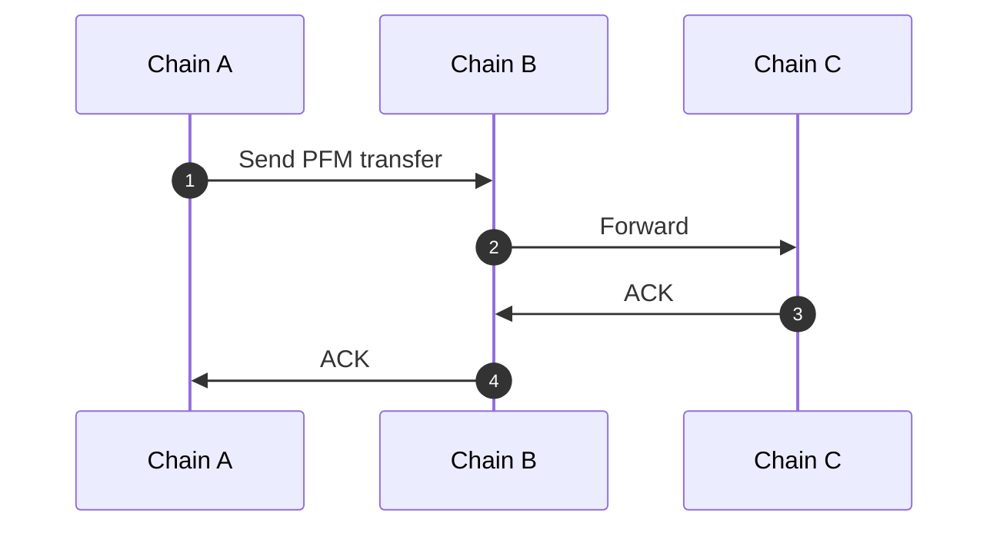
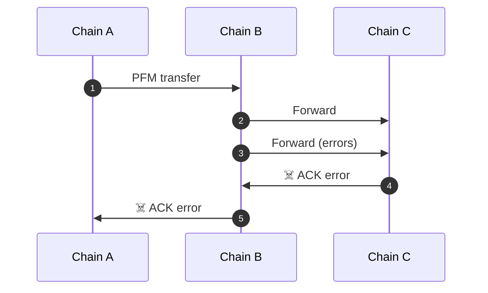
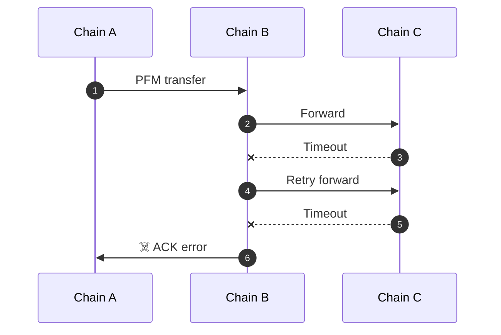

# Packet Forward Middleware Flows

This document outlines some example flows leveraging packet forward middleware and formats of the memo field. 

## Example Scenarios

### Successful Transfer forwarding through chain B



### Memo for simple forward

- The packet-forward-middleware integrated on Chain B.
- The packet data `receiver` for the `MsgTransfer` on Chain A is set to `"pfm"` or some other invalid bech32 string.*
- The packet `memo` is included in `MsgTransfer` by user on Chain A.

```json
{
  "forward": {
    "receiver": "chain-c-bech32-address",
    "port": "transfer",
    "channel": "channel-123"
  }
}
```

### Error on Forwarding Hop, Refund to A



### Forwarding with Retry and Timeout Logic



### A -> B -> C full success

1. `A` This sends packet over underlying ICS-004 wrapper with memo as is.
2. `B` This receives packet and parses it into ICS-020 packet.
3. `B` Validates `forward` packet on this step, return `ACK` error if fails.
4. `B` If other middleware not yet called ICS-020, call it and ACK error on fail. Tokens minted or unescrowed here.
5. `B` Handle denom. If denom prefix is from `B`, remove it. If denom prefix is other chain - add `B` prefix.
6. `B` Take fee, create new ICS-004 packet with timeout from forward for next step, and remaining inner `memo`.
7. `B` Send transfer to `C` with parameters obtained from `memo`. Tokens burnt or escrowed here.
8. `B` Store tracking `in flight packet` under next `(channel, port, ICS-20 transfer sequence)`, do not `ACK` packet yet.
9. `C` Handle ICS-020 packet as usual.
10. `B` On ICS-020 ACK from `C` find `in flight packet`, delete it and write `ACK` for original packet from `A`.
11. `A` Handle ICS-020 `ACK` as usual

[Example](https://mintscan.io/osmosis-testnet/txs/FAB912347B8729FFCA92AC35E6B1E83BC8169DE7CC2C254A5A3F70C8EC35D771?height=3788973) of USDC transfer from Osmosis -> Noble -> Sei

### A -> B -> C with C error ACK

10. `B` On ICS-020 ACK from `C` find `in flight packet`, delete it
11. `B` Burns or escrows tokens.
12. `B` And write error `ACK` for original packet from `A`.
13. `A` Handle ICS-020 timeout as usual
14. `C` writes success `ACK` for packet from `B`

Same behavior in case of timeout on `C`

### A packet timeouts on B before C timeouts packet from B

10. `A` Cannot timeout because `in flight packet` has proof on `B` of packet inclusion.
11. `B` waits for ACK or timeout from `C`.
12. `B` timeout from `C` becomes fail `ACK` on `B` for `A`
13. `A` receives success or fail `ACK`, but not timeout

In this case `A` assets `hang` until final hop timeouts or ACK.

### Memo for Retry and Timeout Logic, with Nested Memo (2 forwards)

- The packet-forward-middleware integrated on Chain B and Chain C.
- The packet data `receiver` for the `MsgTransfer` on Chain A is set to `"pfm"` or some other invalid bech32 string.
- The forward metadata `receiver` for the hop from Chain B to Chain C is set to `"pfm"` or some other invalid bech32 string.
- The packet `memo` is included in `MsgTransfer` by user on Chain A.
- A packet timeout of 10 minutes and 2 retries is set for both forwards.

In the case of a timeout after 10 minutes for either forward, the packet would be retried up to 2 times, afterwards an error ack would be written to issue a refund on the prior chain.

`next` is the `memo` to pass for the next transfer hop. Per `memo` intended usage of a JSON string, it should be either JSON which will be Marshaled retaining key order, or an escaped JSON string which will be passed directly.

`next` as JSON

```json
{
  "forward": {
    "receiver": "pfm", // intentionally invalid
    "port": "transfer",
    "channel": "channel-123",
    "timeout": "10m",
    "retries": 2,
    "next": {
      "forward": {
        "receiver": "chain-d-bech32-address",
        "port": "transfer",
        "channel": "channel-234",
        "timeout": "10m",
        "retries": 2
      }
    }
  }
}
```

## Intermediate Address Security

Intermediate chains don’t need a valid receiver address. Instead, they derive a secure address from the packet’s sender and channel, preventing users from forwarding tokens to arbitrary accounts.

To avoid accidental transfers to chains without PFM, use an invalid bech32 address (e.g., "pfm") for intermediate receivers.
