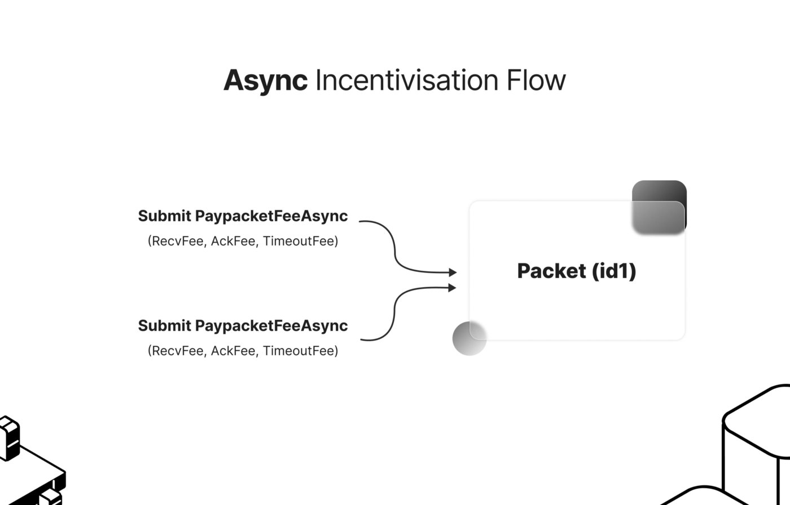

<!--
order: 3
-->

# Fee messages

Learn about the different ways to pay for fees, how the fees are paid out and what happens when not enough escrowed fees are available for payout {synopsis}

## Escrowing fees

The fee middleware module exposes two different ways to pay fees for relaying IBC packets:

1. `MsgPayPacketFee`, which enables the escrowing of fees for a packet at the next sequence send and should be combined into one `MultiMsgTx` with the message that will be paid for.

   Note that the `Relayers` field has been set up to allow for an optional whitelist of relayers permitted to receive this fee, however, this feature has not yet been enabled at this time.

   ```go
   type MsgPayPacketFee struct{
     // fee encapsulates the recv, ack and timeout fees associated with an IBC packet
     Fee                 Fee
     // the source port unique identifier
     SourcePortId        string
     // the source channel unique identifer
     SourceChannelId     string
     // account address to refund fee if necessary
     Signer              string
     // optional list of relayers permitted to the receive packet fee
     Relayers            []string
   }
   ```

   The `Fee` message contained in this synchronous fee payment method configures different fees which will be paid out for `MsgRecvPacket`, `MsgAcknowledgement`, and `MsgTimeout`/`MsgTimeoutOnClose`.

   ```go
   type Fee struct {
       RecvFee             types.Coins
       AckFee              types.Coins
       TimeoutFee          types.Coins
   }
   ```

The diagram below shows the `MultiMsgTx` with the `MsgTransfer` coming from a token transfer message, along with `MsgPayPacketFee`.


2. `MsgPayPacketFeeAsync`, which enables the asynchronous escrowing of fees for a specified packet:

   Note that a packet can be 'topped up' multiple times with additional fees of any coin denomination by broadcasting multiple `MsgPayPacketFeeAsync` messages.

   ```go
   type MsgPayPacketFeeAsync struct {
     // unique packet identifier comprised of the channel ID, port ID and sequence
     PacketId            channeltypes.PacketId
     // the packet fee associated with a particular IBC packet
     PacketFee           PacketFee
   }
   ```

   where the `PacketFee` also specifies the `Fee` to be paid as well as the refund address for fees which are not paid out

   ```go
   type PacketFee struct {
       Fee                    Fee
       RefundAddress          string
       Relayers               []string
   }
   ```

The diagram below shows how multiple `MsgPayPacketFeeAsync` can be broadcasted asynchronously. Escrowing of the fee associated with a packet can be carried out by any party because ICS-29 does not dictate a particular fee payer. In fact, chains can choose to simply not expose this fee payment to end users at all and rely on a different module account or even the community pool as the source of relayer incentives.



Please see our [wiki](https://github.com/cosmos/ibc-go/wiki/Fee-enabled-fungible-token-transfers) for example flows on how to use these messages to incentivise a token transfer channel using a CLI.

## Paying out the escrowed fees

Following diagram takes a look at the packet flow for an incentivized token transfer and investigates the several scenario's for paying out the escrowed fees. We assume that the relayers have registered their counterparty address, detailed in the [Fee distribution section](../ics29-fee/fee-distribution.md).


- In the case of a successful transaction, `RecvFee` will be paid out to the designated counterparty payee address which has been registered on the receiver chain and sent back with the `MsgAcknowledgement`, `AckFee` will be paid out to the relayer address which has submitted the `MsgAcknowledgement` on the sending chain (or the registered payee in case one has been registered for the relayer address), and `TimeoutFee` will be reimbursed to the account which escrowed the fee.
- In case of a timeout transaction, `RecvFee` and `AckFee` will be reimbursed. The `TimeoutFee` will be paid to the `Timeout Relayer` (who submits the timeout message to the source chain).

> Please note that fee payments are built on the assumption that sender chains are the source of incentives — the chain that sends the packets is the same chain where fee payments will occur -- please see the [Fee distribution section](../ics29-fee/fee-distribution.md) to understand the flow for registering payee and counterparty payee (fee receiving) addresses.

## A locked fee middleware module

The fee middleware module can become locked if the situation arises that the escrow account for the fees does not have sufficient funds to pay out the fees which have been escrowed for each packet. _This situation indicates a severe bug._ In this case, the fee module will be locked until manual intervention fixes the issue.

> A locked fee module will simply skip fee logic and continue on to the underlying packet flow. A channel with a locked fee module will temporarily function as a fee disabled channel, and the locking of a fee module will not affect the continued flow of packets over the channel.
