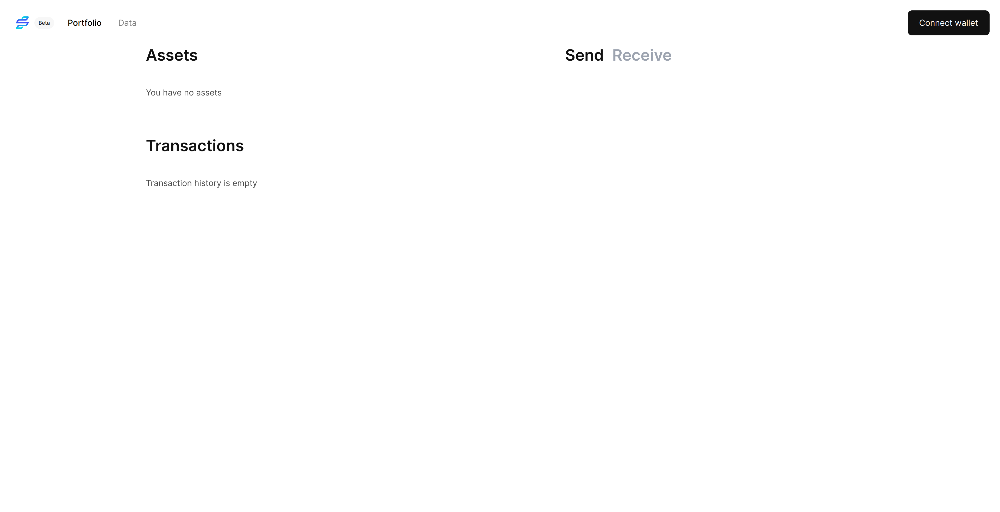

import CodeBlock from '@theme/CodeBlock';

# Scaffold a React app

In this section, we will scaffold a React app using Ignite CLI, and test it. This will be the base for us to add Fee Middleware support.

## Set up test wallets

We will use 4 test wallets for this tutorial. Use the following mnemonic phrases to import them into Keplr.

```text title="anna.mnemonic"
antenna hen skate tooth during heart agent code exclude measure text math time budget industry cage eagle prosper program enter cruise join tragic one
```

```text title="bo.mnemonic"
uphold tube excess primary night armor circle puzzle pet memory empower conduct blush hat glare tortoise into embody powder raise punch promote kidney catalog
```

```text title="charlie.mnemonic"
rug cotton ceiling olive cake october way spy million grain actress sponsor
```

```text title="damian.mnemonic"
mansion wing limit daughter allow fiscal attend planet viable giggle prison ready
```

Then add these wallet mnemonics to [`config.yml`](https://github.com/srdtrk/cosmoverse2023-ibc-fee-demo/blob/65032986f671e901bc13ab160e3f96a5046857c0/config.yml) so that they are funded automatically by ignite.

```yaml title="config.yml"
version: 1
accounts:
- name: alice
  coins:
  - 20000token
  - 200000000stake
- name: bob
  coins:
  - 10000token
  - 100000000stake
# plus-diff-start
- name: anna
  coins: 
  - 20000token
  - 200000000stake
  mnemonic: antenna hen skate tooth during heart agent code exclude measure text math time budget industry cage eagle prosper program enter cruise join tragic one
- name: bo
  coins: 
  - 20000token
  - 200000000stake
  mnemonic: uphold tube excess primary night armor circle puzzle pet memory empower conduct blush hat glare tortoise into embody powder raise punch promote kidney catalog
- name: charlie
  coins: 
  - 20000token
  - 200000000stake
  mnemonic: rug cotton ceiling olive cake october way spy million grain actress sponsor
- name: damian
  coins: 
  - 20000token
  - 200000000stake
  mnemonic: mansion wing limit daughter allow fiscal attend planet viable giggle prison ready
# plus-diff-end
client:
  openapi:
    path: docs/static/openapi.yml
faucet:
  name: bob
  coins:
  - 5token
  - 100000stake
validators:
- name: alice
  bonded: 100000000stake
```

## Scaffold a React app

Scaffold a React app using the following command:

<CodeBlock className="language-bash" title=<a href="https://github.com/srdtrk/cosmoverse2023-ibc-fee-demo/commit/51b8e3304f5c8c2e2e477dac9985237be676254b">View Source</a>>
ignite scaffold react
</CodeBlock>

For this will create a React app within the `react/` directory. The app depends on a typescript client that is yet to be generated.
The following command generates the typescript client for the chain, including the Fee Middleware types, and its react hooks.

<CodeBlock className="language-bash" title=<a href="https://github.com/srdtrk/cosmoverse2023-ibc-fee-demo/commit/6b31da02d1ca4fba70d58a3b3e56d9f1e3f06833">View Source</a>>
ignite generate hooks --clear-cache
</CodeBlock>

:::caution

You need to add `--clear-cache` to the command above to make sure that the custom modules' (such as Fee Middleware) types are generated.

:::

### Update the dependencies

The generated React app and ts-client depends on the `@cosmjs` packages. We need to update the dependencies to the latest version because the Cosmos SDK version is not fully compatible with the version of `@cosmjs` packages used by the generated app.
Run the following commands in the root directory of the project to update the dependencies.

<CodeBlock className="language-bash" title=<a href="https://github.com/srdtrk/cosmoverse2023-ibc-fee-demo/commit/dffcf719fd8c223be06d3327e6bc24ec7cf0cec3">View Source</a>>
cd ts-client && 
npm install @cosmjs/launchpad@0.27.1 @cosmjs/proto-signing@0.31.1 @cosmjs/stargate@0.31.1 @keplr-wallet/types@0.11.14
</CodeBlock>

<CodeBlock className="language-bash" title=<a href="https://github.com/srdtrk/cosmoverse2023-ibc-fee-demo/commit/1c90ffddbab1655038dc296874f427b036afb749">View Source</a>>
cd react && 
npm install @cosmjs/proto-signing@0.31.1 @cosmjs/stargate@0.31.1 @cosmjs/encoding@0.31.1
</CodeBlock>

### Fix the bugs

There is a bug in the generated app that we need to fix. While this is fixed in the next version of Ignite CLI, we need to fix it manually for now since we are using the latest version (`v0.27.1`) of Ignite CLI. (The next version of ignite comes with the Fee Middleware wired!)

The bug is in the `react/src/hooks/useIbcApplicationsTransferV1/index.ts` file. For some reason, the generated code uses the string `=**` in certain places. We need to remove this using replace.
You can use the following command to fix this (or simply use your editor to replace the string with an empty string):

<CodeBlock className="language-bash" title=<a href="https://github.com/srdtrk/cosmoverse2023-ibc-fee-demo/commit/17c40b79109712460f8f2613c19f3a5fe9519e33">View Source</a>>
sed -i 's/=\*\*//g' react/src/hooks/useIbcApplicationsTransferV1/index.ts
</CodeBlock>

## Test the app

### Start the chain

Start the chain using the following command:

```bash
ignite chain serve --reset-once
```

### Start the React app

Start the React app in a separate terminal using the following command:

```bash
cd react
npm run dev
```

You should see the following screen:



Connect your keplr wallet (as one of the test wallets) to the app. You should see the following screen:


Feel free to play around with the app. You can send tokens to other wallets, however, IBC transfers will not work at this point since we are not running any IBC relayer.
