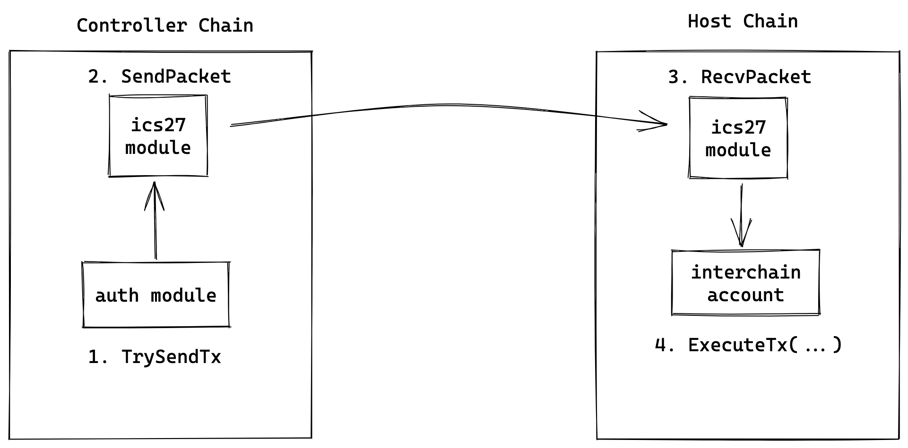

# Transactions

:::note Synopsis
Learn about Interchain Accounts transaction execution 
:::

## Executing a transaction

As described in [Authentication Modules](02-auth-modules.md#trysendtx) transactions are executed using the interchain accounts controller API and require a `Base Application` as outlined in [ICS30 IBC Middleware](https://github.com/cosmos/ibc/tree/master/spec/app/ics-030-middleware) to facilitate authentication. The method of authentication remains unspecified to provide flexibility for the authentication module developer.

Transactions are executed via the ICS27 [`SendTx` API](02-auth-modules.md#trysendtx). This must be invoked through an Interchain Accounts authentication module and follows the outlined path of execution below. Packet relaying semantics provided by the IBC core transport, authentication, and ordering (IBC/TAO) layer are omitted for brevity.

## Atomicity

As the Interchain Accounts module supports the execution of multiple transactions using the Cosmos SDK `Msg` interface, it provides the same atomicity guarantees as Cosmos SDK-based applications, leveraging the [`CacheMultiStore`](https://docs.cosmos.network/main/learn/advanced/store#cachemultistore) architecture provided by the [`Context`](https://docs.cosmos.network/main/learn/advanced/context.html) type.

This provides atomic execution of transactions when using Interchain Accounts, where state changes are only committed if all `Msg`s succeed.
