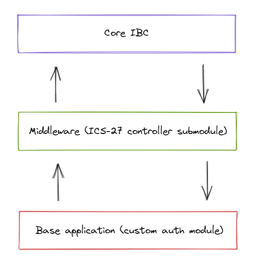

# Integration

## Deprecation Notice

**This document is deprecated and will be removed in future releases**.

:::note Synopsis
Learn how to integrate Interchain Accounts host and controller functionality to your chain. The following document only applies for Cosmos SDK chains.
:::

The Interchain Accounts module contains two submodules. Each submodule has its own IBC application. The Interchain Accounts module should be registered as an `AppModule` in the same way all SDK modules are registered on a chain, but each submodule should create its own `IBCModule` as necessary. A route should be added to the IBC router for each submodule which will be used.

Chains who wish to support ICS-27 may elect to act as a host chain, a controller chain or both. Disabling host or controller functionality may be done statically by excluding the host or controller module entirely from the `app.go` file or it may be done dynamically by taking advantage of the on-chain parameters which enable or disable the host or controller submodules.

Interchain Account authentication modules are the base application of a middleware stack. The controller submodule is the middleware in this stack.



> Please note that since ibc-go v6 the channel capability is claimed by the controller submodule and therefore it is not required for authentication modules to claim the capability in the `OnChanOpenInit` callback. Therefore the custom authentication module does not need a scoped keeper anymore.
> Please note that since ibc-go v7.5.0 it is mandatory to register the gRPC query router after the creation of the host submodule's keeper, otherwise nodes will not start. The query router is used to execute on the host query messages encoded in the ICA packet data. Please check the sample integration code below for more details.

## Example integration

```go
// app.go

// Register the AppModule for the Interchain Accounts module and the authentication module
// Note: No `icaauth` exists, this must be substituted with an actual Interchain Accounts authentication module
ModuleBasics = module.NewBasicManager(
  ...
  ica.AppModuleBasic{},
  icaauth.AppModuleBasic{},
  ...
)

... 

// Add module account permissions for the Interchain Accounts module
// Only necessary for host chain functionality
// Each Interchain Account created on the host chain is derived from the module account created
maccPerms = map[string][]string{
  ...
  icatypes.ModuleName:            nil,
}

...

// Add Interchain Accounts Keepers for each submodule used and the authentication module
// If a submodule is being statically disabled, the associated Keeper does not need to be added. 
type App struct {
  ...

  ICAControllerKeeper icacontrollerkeeper.Keeper
  ICAHostKeeper       icahostkeeper.Keeper
  ICAAuthKeeper       icaauthkeeper.Keeper

  ...
}

...

// Create store keys for each submodule Keeper and the authentication module
keys := sdk.NewKVStoreKeys(
  ...
  icacontrollertypes.StoreKey,
  icahosttypes.StoreKey,
  icaauthtypes.StoreKey,
  ...
)

... 

// Create the scoped keepers for each submodule keeper and authentication keeper
scopedICAControllerKeeper := app.CapabilityKeeper.ScopeToModule(icacontrollertypes.SubModuleName)
scopedICAHostKeeper := app.CapabilityKeeper.ScopeToModule(icahosttypes.SubModuleName)

...

// Create the Keeper for each submodule
app.ICAControllerKeeper = icacontrollerkeeper.NewKeeper(
  appCodec, keys[icacontrollertypes.StoreKey], app.GetSubspace(icacontrollertypes.SubModuleName),
  app.IBCKeeper.ChannelKeeper, // may be replaced with middleware such as ics29 fee
  app.IBCKeeper.ChannelKeeper, &app.IBCKeeper.PortKeeper,
  scopedICAControllerKeeper, app.MsgServiceRouter(),
)
app.ICAHostKeeper = icahostkeeper.NewKeeper(
  appCodec, keys[icahosttypes.StoreKey], app.GetSubspace(icahosttypes.SubModuleName),
  app.IBCKeeper.ChannelKeeper, // may be replaced with middleware such as ics29 fee
  app.IBCKeeper.ChannelKeeper, &app.IBCKeeper.PortKeeper,
  app.AccountKeeper, scopedICAHostKeeper, app.MsgServiceRouter(),
)
app.ICAHostKeeper.WithQueryRouter(app.GRPCQueryRouter())

// Create Interchain Accounts AppModule
icaModule := ica.NewAppModule(&app.ICAControllerKeeper, &app.ICAHostKeeper)

// Create your Interchain Accounts authentication module
app.ICAAuthKeeper = icaauthkeeper.NewKeeper(appCodec, keys[icaauthtypes.StoreKey], app.ICAControllerKeeper)

// ICA auth AppModule
icaAuthModule := icaauth.NewAppModule(appCodec, app.ICAAuthKeeper)

// ICA auth IBC Module
icaAuthIBCModule := icaauth.NewIBCModule(app.ICAAuthKeeper)

// Create controller IBC application stack and host IBC module as desired
icaControllerStack := icacontroller.NewIBCMiddleware(icaAuthIBCModule, app.ICAControllerKeeper)
icaHostIBCModule := icahost.NewIBCModule(app.ICAHostKeeper)

// Register host and authentication routes
ibcRouter.
  AddRoute(icacontrollertypes.SubModuleName, icaControllerStack).
  AddRoute(icahosttypes.SubModuleName, icaHostIBCModule).
  AddRoute(icaauthtypes.ModuleName, icaControllerStack) // Note, the authentication module is routed to the top level of the middleware stack

...

// Register Interchain Accounts and authentication module AppModule's
app.moduleManager = module.NewManager(
  ...
  icaModule,
  icaAuthModule,
)

...

// Add fee middleware to begin blocker logic
app.moduleManager.SetOrderBeginBlockers(
  ...
  icatypes.ModuleName,
  ...
)

// Add fee middleware to end blocker logic
app.moduleManager.SetOrderEndBlockers(
  ...
  icatypes.ModuleName,
  ...
)

// Add Interchain Accounts module InitGenesis logic
app.moduleManager.SetOrderInitGenesis(
  ...
  icatypes.ModuleName,
  ...
)

// initParamsKeeper init params keeper and its subspaces
func initParamsKeeper(appCodec codec.BinaryCodec, legacyAmino *codec.LegacyAmino, key, tkey sdk.StoreKey) paramskeeper.Keeper {
  ...
  paramsKeeper.Subspace(icahosttypes.SubModuleName)
  paramsKeeper.Subspace(icacontrollertypes.SubModuleName)
  ...
```

## Using submodules exclusively

As described above, the Interchain Accounts application module is structured to support the ability of exclusively enabling controller or host functionality.
This can be achieved by simply omitting either controller or host `Keeper` from the Interchain Accounts `NewAppModule` constructor function, and mounting only the desired submodule via the `IBCRouter`.
Alternatively, submodules can be enabled and disabled dynamically using [on-chain parameters](../06-parameters.md).

The following snippets show basic examples of statically disabling submodules using `app.go`.

### Disabling controller chain functionality

```go
// Create Interchain Accounts AppModule omitting the controller keeper
icaModule := ica.NewAppModule(nil, &app.ICAHostKeeper)

// Create host IBC Module
icaHostIBCModule := icahost.NewIBCModule(app.ICAHostKeeper)

// Register host route
ibcRouter.AddRoute(icahosttypes.SubModuleName, icaHostIBCModule)
```

### Disabling host chain functionality

```go
// Create Interchain Accounts AppModule omitting the host keeper
icaModule := ica.NewAppModule(&app.ICAControllerKeeper, nil)

// Create your Interchain Accounts authentication module, setting up the Keeper, AppModule and IBCModule appropriately
app.ICAAuthKeeper = icaauthkeeper.NewKeeper(appCodec, keys[icaauthtypes.StoreKey], app.ICAControllerKeeper)
icaAuthModule := icaauth.NewAppModule(appCodec, app.ICAAuthKeeper)
icaAuthIBCModule := icaauth.NewIBCModule(app.ICAAuthKeeper)

// Create controller IBC application stack
icaControllerStack := icacontroller.NewIBCMiddleware(icaAuthIBCModule, app.ICAControllerKeeper)

// Register controller and authentication routes
ibcRouter.
  AddRoute(icacontrollertypes.SubModuleName, icaControllerStack).
  AddRoute(icaauthtypes.ModuleName, icaControllerStack) // Note, the authentication module is routed to the top level of the middleware stack
```
