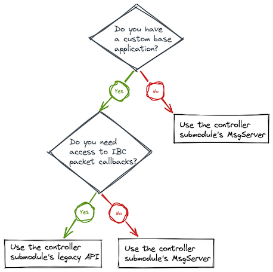

# Migrating from ibc-go v5 to v6

This document is intended to highlight significant changes which may require more information than presented in the CHANGELOG.
Any changes that must be done by a user of ibc-go should be documented here.

There are four sections based on the four potential user groups of this document:

- Chains
- IBC Apps
- Relayers
- IBC Light Clients

**Note:** ibc-go supports golang semantic versioning and therefore all imports must be updated to bump the version number on major releases.

## Chains

The `ibc-go/v6` release introduces a new set of migrations for `27-interchain-accounts`. Ownership of ICS27 channel capabilities is transferred from ICS27 authentication modules and will now reside with the ICS27 controller submodule moving forward.

For chains which contain a custom authentication module using the ICS27 controller submodule this requires a migration function to be included in the chain upgrade handler. A subsequent migration handler is run automatically, asserting the ownership of ICS27 channel capabilities has been transferred successfully.

This migration is not required for chains which *do not* contain a custom authentication module using the ICS27 controller submodule.

This migration facilitates the addition of the ICS27 controller submodule `MsgServer` which provides a standardised approach to integrating existing forms of authentication such as `x/gov` and `x/group` provided by the Cosmos SDK.

For more information please refer to [ADR 009](/architecture/adr-009-v6-ics27-msgserver).

### Upgrade proposal

Please refer to [PR #2383](https://github.com/cosmos/ibc-go/pull/2383) for integrating the ICS27 channel capability migration logic or follow the steps outlined below:

1. Add the upgrade migration logic to chain distribution. This may be, for example, maintained under a package `app/upgrades/v6`.

```go
package v6

import (
  "github.com/cosmos/cosmos-sdk/codec"
  storetypes "github.com/cosmos/cosmos-sdk/store/types"
  sdk "github.com/cosmos/cosmos-sdk/types"
  "github.com/cosmos/cosmos-sdk/types/module"
  capabilitykeeper "github.com/cosmos/cosmos-sdk/x/capability/keeper"
  upgradetypes "github.com/cosmos/cosmos-sdk/x/upgrade/types"

  v6 "github.com/cosmos/ibc-go/v6/modules/apps/27-interchain-accounts/controller/migrations/v6"
)

const (
  UpgradeName = "v6"
)

func CreateUpgradeHandler(
  mm *module.Manager,
  configurator module.Configurator,
  cdc codec.BinaryCodec,
  capabilityStoreKey *storetypes.KVStoreKey,
  capabilityKeeper *capabilitykeeper.Keeper,
  moduleName string,
) upgradetypes.UpgradeHandler {
  return func(ctx sdk.Context, _ upgradetypes.Plan, vm module.VersionMap) (module.VersionMap, error) {
    if err := v6.MigrateICS27ChannelCapability(ctx, cdc, capabilityStoreKey, capabilityKeeper, moduleName); err != nil {
      return nil, err
    }

    return mm.RunMigrations(ctx, configurator, vm)
  }
}
```

2. Set the upgrade handler in `app.go`. The `moduleName` parameter refers to the authentication module's `ScopedKeeper` name. This is the name provided upon instantiation in `app.go` via the [`x/capability` keeper `ScopeToModule(moduleName string)`](https://github.com/cosmos/cosmos-sdk/blob/v0.46.1/x/capability/keeper/keeper.go#L70) method. [See here for an example in `simapp`](https://github.com/cosmos/ibc-go/blob/v5.0.0/testing/simapp/app.go#L304).

```go
app.UpgradeKeeper.SetUpgradeHandler(
  v6.UpgradeName,
  v6.CreateUpgradeHandler(
    app.mm,
    app.configurator,
    app.appCodec,
    app.keys[capabilitytypes.ModuleName],
    app.CapabilityKeeper,
    >>>> moduleName <<<<,
  ),
)
```

## IBC Apps

### ICS27 - Interchain Accounts

#### Controller APIs

In previous releases of ibc-go, chain developers integrating the ICS27 interchain accounts controller functionality were expected to create a custom `Base Application` referred to as an authentication module, see the section [Building an authentication module](../02-apps/02-interchain-accounts/03-auth-modules.md) from the documentation.

The `Base Application` was intended to be composed with the ICS27 controller submodule `Keeper` and facilitate many forms of message authentication depending on a chain's particular use case.

Prior to ibc-go v6 the controller submodule exposed only these two functions (to which we will refer as the legacy APIs):

- [`RegisterInterchainAccount`](https://github.com/cosmos/ibc-go/blob/v5.0.0/modules/apps/27-interchain-accounts/controller/keeper/account.go#L19)
- [`SendTx`](https://github.com/cosmos/ibc-go/blob/v5.0.0/modules/apps/27-interchain-accounts/controller/keeper/relay.go#L18)

However, these functions have now been deprecated in favour of the new controller submodule `MsgServer` and will be removed in later releases.

Both APIs remain functional and maintain backwards compatibility in ibc-go v6, however consumers of these APIs are now recommended to follow the message passing paradigm outlined in Cosmos SDK [ADR 031](https://github.com/cosmos/cosmos-sdk/blob/main/docs/architecture/adr-031-msg-service.md) and [ADR 033](https://github.com/cosmos/cosmos-sdk/blob/main/docs/architecture/adr-033-protobuf-inter-module-comm.md). This is facilitated by the Cosmos SDK [`MsgServiceRouter`](https://github.com/cosmos/cosmos-sdk/blob/main/baseapp/msg_service_router.go#L17) and chain developers creating custom application logic can now omit the ICS27 controller submodule `Keeper` from their module and instead depend on message routing.

Depending on the use case, developers of custom authentication modules face one of three scenarios:



**My authentication module needs to access IBC packet callbacks**

Application developers that wish to consume IBC packet callbacks and react upon packet acknowledgements **must** continue using the controller submodule's legacy APIs. The authentication modules will not need a `ScopedKeeper` anymore, though, because the channel capability will be claimed by the controller submodule. For example, given an Interchain Accounts authentication module keeper `ICAAuthKeeper`, the authentication module's `ScopedKeeper` (`scopedICAAuthKeeper`) is not needed anymore and can be removed for the argument list of the keeper constructor function, as shown here:

```diff
app.ICAAuthKeeper = icaauthkeeper.NewKeeper(
  appCodec,
  keys[icaauthtypes.StoreKey],
  app.ICAControllerKeeper,
- scopedICAAuthKeeper,
)
```

Please note that the authentication module's `ScopedKeeper` name is still needed as part of the channel capability migration described in section [Upgrade proposal](#upgrade-proposal) above. Therefore the authentication module's `ScopedKeeper` cannot be completely removed from the chain code until the migration has run.

In the future, the use of the legacy APIs for accessing packet callbacks will be replaced by IBC Actor Callbacks (see [ADR 008](https://github.com/cosmos/ibc-go/pull/1976) for more details) and it will also be possible to access them with the `MsgServiceRouter`.

**My authentication module does not need access to IBC packet callbacks**

The authentication module can migrate from using the legacy APIs and it can be composed instead with the `MsgServiceRouter`, so that the authentication module is able to pass messages to the controller submodule's `MsgServer` to register interchain accounts and send packets to the interchain account. For example, given an Interchain Accounts authentication module keeper `ICAAuthKeeper`, the ICS27 controller submodule keeper (`ICAControllerKeeper`) and authentication module scoped keeper (`scopedICAAuthKeeper`) are not needed anymore and can be replaced with the `MsgServiceRouter`, as shown here:

```diff
app.ICAAuthKeeper = icaauthkeeper.NewKeeper(
  appCodec,
  keys[icaauthtypes.StoreKey],
- app.ICAControllerKeeper,
- scopedICAAuthKeeper,
+ app.MsgServiceRouter(),
)
```

In your authentication module you can route messages to the controller submodule's `MsgServer` instead of using the legacy APIs. For example, for registering an interchain account:

```diff
- if err := keeper.icaControllerKeeper.RegisterInterchainAccount(
-   ctx,
-   connectionID,
-   owner.String(),
-   version,
- ); err != nil {
-   return err
- }
+ msg := controllertypes.NewMsgRegisterInterchainAccount(
+   connectionID,
+   owner.String(),
+   version,
+ )
+ handler := keeper.msgRouter.Handler(msg)
+ res, err := handler(ctx, msg)
+ if err != nil {
+   return err
+ }
```

where `controllertypes` is an import alias for `"github.com/cosmos/ibc-go/v6/modules/apps/27-interchain-accounts/controller/types"`.

In addition, in this use case the authentication module does not need to implement the `IBCModule` interface anymore.

**I do not need a custom authentication module anymore**

If your authentication module does not have any extra functionality compared to the default authentication module added in ibc-go v6 (the `MsgServer`), or if you can use a generic authentication module, such as the `x/auth`, `x/gov` or `x/group` modules from the Cosmos SDK (v0.46 and later), then you can remove your authentication module completely and use instead the gRPC endpoints of the `MsgServer` or the CLI added in ibc-go v6.

Please remember that the authentication module's `ScopedKeeper` name is still needed as part of the channel capability migration described in section [Upgrade proposal](#upgrade-proposal) above.

#### Host params

The ICS27 host submodule default params have been updated to include the `AllowAllHostMsgs` wildcard `*`.
This enables execution of any `sdk.Msg` type for ICS27 registered on the host chain `InterfaceRegistry`.

```diff
// AllowAllHostMsgs holds the string key that allows all message types on interchain accounts host module
const AllowAllHostMsgs = "*"

...

// DefaultParams is the default parameter configuration for the host submodule
func DefaultParams() Params {
-  return NewParams(DefaultHostEnabled, nil)
+  return NewParams(DefaultHostEnabled, []string{AllowAllHostMsgs})
}
```

#### API breaking changes

`SerializeCosmosTx` takes in a `[]proto.Message` instead of `[]sdk.Message`. This allows for the serialization of proto messages without requiring the fulfillment of the `sdk.Msg` interface.

The `27-interchain-accounts` genesis types have been moved to their own package: `modules/apps/27-interchain-acccounts/genesis/types`.
This change facilitates the addition of the ICS27 controller submodule `MsgServer` and avoids cyclic imports. This should have minimal disruption to chain developers integrating `27-interchain-accounts`.

The ICS27 host submodule `NewKeeper` function in `modules/apps/27-interchain-acccounts/host/keeper` now includes an additional parameter of type `ICS4Wrapper`.
This provides the host submodule with the ability to correctly unwrap channel versions in the event of a channel reopening handshake.

```diff
func NewKeeper(
  cdc codec.BinaryCodec, key storetypes.StoreKey, paramSpace paramtypes.Subspace,
- channelKeeper icatypes.ChannelKeeper, portKeeper icatypes.PortKeeper,
+ ics4Wrapper icatypes.ICS4Wrapper, channelKeeper icatypes.ChannelKeeper, portKeeper icatypes.PortKeeper,
  accountKeeper icatypes.AccountKeeper, scopedKeeper icatypes.ScopedKeeper, msgRouter icatypes.MessageRouter,
) Keeper
```

### ICS29 - `NewKeeper` API change

The `NewKeeper` function of ICS29 has been updated to remove the `paramSpace` parameter as it was unused.

```diff
func NewKeeper(
- cdc codec.BinaryCodec, key storetypes.StoreKey, paramSpace paramtypes.Subspace,
- ics4Wrapper types.ICS4Wrapper, channelKeeper types.ChannelKeeper, portKeeper types.PortKeeper, authKeeper types.AccountKeeper, bankKeeper types.BankKeeper,
+ cdc codec.BinaryCodec, key storetypes.StoreKey,
+ ics4Wrapper types.ICS4Wrapper, channelKeeper types.ChannelKeeper,
+ portKeeper types.PortKeeper, authKeeper types.AccountKeeper, bankKeeper types.BankKeeper,
) Keeper {
```

### ICS20 - `SendTransfer` is no longer exported

The `SendTransfer` function of ICS20 has been removed. IBC transfers should now be initiated with `MsgTransfer` and routed to the ICS20 `MsgServer`.

See below for example:

```go
if handler := msgRouter.Handler(msgTransfer); handler != nil {
  if err := msgTransfer.ValidateBasic(); err != nil {
    return nil, err
  }

  res, err := handler(ctx, msgTransfer)
  if err != nil {
    return nil, err
  }
}
```

### ICS04 - `SendPacket` API change

The `SendPacket` API has been simplified:

```diff
// SendPacket is called by a module in order to send an IBC packet on a channel
func (k Keeper) SendPacket(
  ctx sdk.Context,
  channelCap *capabilitytypes.Capability,
- packet exported.PacketI,
-) error {
+ sourcePort string,
+ sourceChannel string,
+ timeoutHeight clienttypes.Height,
+ timeoutTimestamp uint64,
+ data []byte,
+) (uint64, error) {
```

Callers no longer need to pass in a pre-constructed packet.
The destination port/channel identifiers and the packet sequence will be determined by core IBC.
`SendPacket` will return the packet sequence.

### IBC testing package

The `SendPacket` API has been simplified:

```diff
// SendPacket is called by a module in order to send an IBC packet on a channel
func (k Keeper) SendPacket(
  ctx sdk.Context,
  channelCap *capabilitytypes.Capability,
- packet exported.PacketI,
-) error {
+ sourcePort string,
+ sourceChannel string,
+ timeoutHeight clienttypes.Height,
+ timeoutTimestamp uint64,
+ data []byte,
+) (uint64, error) {
```

Callers no longer need to pass in a pre-constructed packet. `SendPacket` will return the packet sequence.

## Relayers

- No relevant changes were made in this release.

## IBC Light Clients

- No relevant changes were made in this release.
