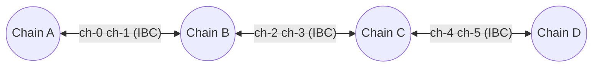
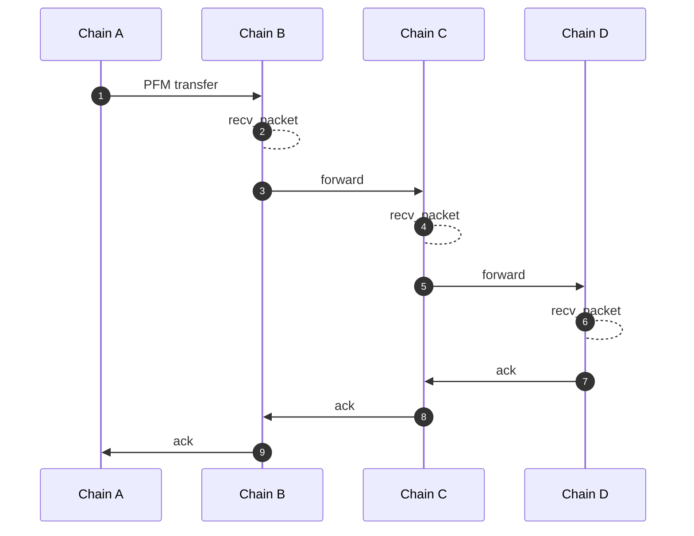
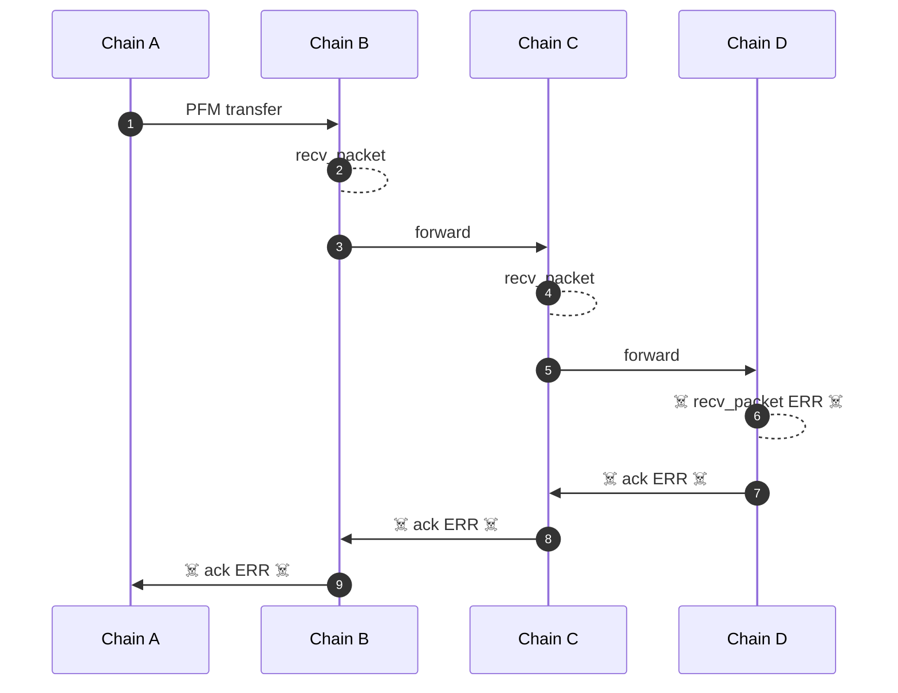
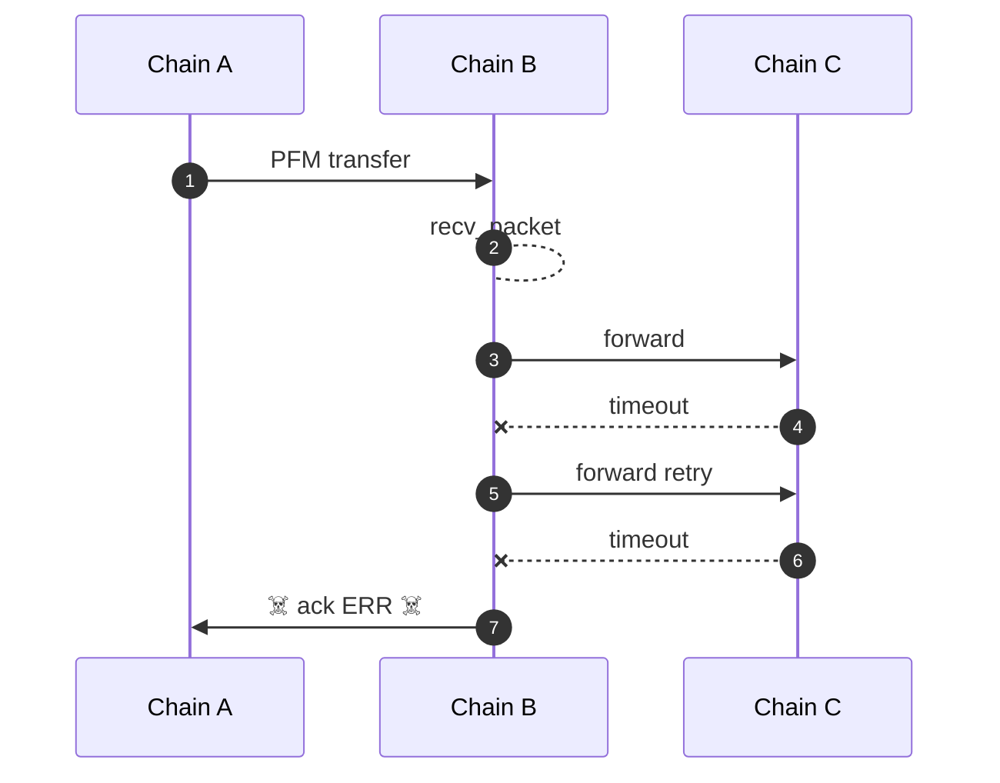

# packet-forward-middleware
Middleware for forwarding IBC packets.

Asynchronous acknowledgements are utilized for atomic multi-hop packet flows. The acknowledgement will only be written on the chain where the user initiated the packet flow after the forward/multi-hop sequence has completed (success or failure). This means that a user (i.e. an IBC application) only needs to monitor the chain where the initial transfer was sent for the response of the entire process.

## About

The packet-forward-middleware is an IBC middleware module built for Cosmos blockchains utilizing the IBC protocol. A chain which incorporates the
packet-forward-middleware is able to route incoming IBC packets from a source chain to a destination chain. As the Cosmos SDK/IBC become commonplace in the
blockchain space more and more zones will come online, these new zones joining are noticing a problem: they need to maintain a large amount of infrastructure
(archive nodes and relayers for each counterparty chain) to connect with all the chains in the ecosystem, a number that is continuing to increase quickly. Luckily
this problem has been anticipated and IBC has been architected to accommodate multi-hop transactions. However, a packet forwarding/routing feature was not in the
initial IBC release.

## Sequence diagrams

### Let's stipulate the following connections between chains A, B, C, and D



### SCENARIO: Via PFM, Chain A wants to pass a message to Chain D (to which it's not directly connected).


### SCENARIO: Multi-hop A->B->C->D, C->D `recv_packet` error, refund back to A



### SCENARIO: Forward A->B->C with 1 retry, max timeouts occurs, refund back to A



## Examples

Utilizing the packet `memo` field, instructions can be encoded as JSON for multi-hop sequences.

### Minimal Example - Chain forward A->B->C

- The packet-forward-middleware integrated on Chain B.
- The packet data `receiver` for the `MsgTransfer` on Chain A is set to `"pfm"` or some other invalid bech32 string.*
- The packet `memo` is included in `MsgTransfer` by user on Chain A.

memo:
```json
{
  "forward": {
    "receiver": "chain-c-bech32-address",
    "port": "transfer",
    "channel": "channel-123"
  }
}
```

### Full Example - Chain forward A->B->C->D with retry on timeout

- The packet-forward-middleware integrated on Chain B and Chain C.
- The packet data `receiver` for the `MsgTransfer` on Chain A is set to `"pfm"` or some other invalid bech32 string.*
- The forward metadata `receiver` for the hop from Chain B to Chain C is set to `"pfm"` or some other invalid bech32 string.*
- The packet `memo` is included in `MsgTransfer` by user on Chain A.
- A packet timeout of 10 minutes and 2 retries is set for both forwards.

In the case of a timeout after 10 minutes for either forward, the packet would be retried up to 2 times, at which case an error ack would be written to issue a refund on the prior chain.

`next` is the `memo` to pass for the next transfer hop. Per `memo` intended usage of a JSON string, it should be either JSON which will be Marshaled retaining key order, or an escaped JSON string which will be passed directly.

`next` as JSON
```json
{
  "forward": {
    "receiver": "pfm", // purposely using invalid bech32 here*
    "port": "transfer",
    "channel": "channel-123",
    "timeout": "10m",
    "retries": 2,
    "next": {
      "forward": {
        "receiver": "chain-d-bech32-address",
        "port": "transfer",
        "channel":"channel-234",
        "timeout":"10m",
        "retries": 2
      }
    }
  }
}
```

`next` as escaped JSON string
```json
{
  "forward": {
    "receiver": "pfm", // purposely using invalid bech32 here*
    "port": "transfer",
    "channel": "channel-123",
    "timeout": "10m",
    "retries": 2,
    "next": "{\"forward\":{\"receiver\":\"chain-d-bech32-address\",\"port\":\"transfer\",\"channel\":\"channel-234\",\"timeout\":\"10m\",\"retries\":2}}"
  }
}
```

## Intermediate Receivers*

PFM does not need the packet data `receiver` address to be valid, as it will create a hash of the sender and channel to derive a receiver address on the intermediate chains. This is done for security purposes to ensure that users cannot move funds through arbitrary accounts on intermediate chains.

To prevent accidentally sending funds to a chain which does not have PFM, it is recommended to use an invalid bech32 string (such as `"pfm"`) for the `receiver` on intermediate chains.  By using an invalid bech32 string, a transfer that is accidentally sent to a chain that does not have PFM would fail to be received, and properly refunded to the user on the source chain, rather than having funds get stuck on the intermediate chain.

The examples above show the intended usage of the `receiver` field for one or multiple intermediate PFM chains.

## Implementation details

Flow sequence mainly encoded in [middleware](packetforward/ibc_middleware.go) and in [keeper](packetforward/keeper/keeper.go).

Describes `A` sending to `C` via `B` in several scenarios with operational opened channels, enabled denom composition, fees and available to refund, but no retries.

Generally without `memo` to handle, all handling by this module is delegated to ICS-020. ICS-020 ACK are written and parsed in any case (ACK are backwarded).

### A -> B -> C full success

1. `A` This sends packet over underlying ICS-004 wrapper with memo as is.
2. `B` This receives packet and parses it into ICS-020 packet.
3. `B` Validates `forward` packet on this step, return `ACK` error if fails.
4. `B` If other middleware not yet called ICS-020, call it and ACK error on fail. Tokens minted or unescrowed here.
5. `B` Handle denom. If denom prefix is from `B`, remove it. If denom prefix is other chain - add `B` prefix.
6. `B` Take fee, create new ICS-004 packet with timeout from forward for next step, and remaining inner `memo`.
7. `B` Send transfer to `C` with parameters obtained from `memo`. Tokens burnt or escrowed here.
8.  `B` Store tracking `in flight packet` under next `(channel, port, ICS-20 transfer sequence)`, do not `ACK` packet yet.
9.  `C` Handle ICS-020 packet as usual.
10. `B` On ICS-020 ACK from `C` find `in flight packet`, delete it and write `ACK` for original packet from `A`.
11. `A` Handle ICS-020 `ACK` as usual

[Example](https://mintscan.io/osmosis-testnet/txs/FAB912347B8729FFCA92AC35E6B1E83BC8169DE7CC2C254A5A3F70C8EC35D771?height=3788973) of USDC transfer from Osmosis -> Noble -> Sei

### A -> B -> C with C error ACK

10. `B` On ICS-020 ACK from `C` find `in flight packet`, delete it
11. `B` Burns or escrows tokens.
12. `B` And write error `ACK` for original packet from `A`.
13. `A` Handle ICS-020 timeout as usual
14. `C` writes success `ACK` for packet from `B`

Same behavior in case of timeout on `C`

### A packet timeouts on B before C timeouts packet from B

10. `A` Cannot timeout because `in flight packet` has proof on `B` of packet inclusion.
11. `B` waits for ACK or timeout from `C`.
12. `B` timeout from `C` becomes fail `ACK` on `B` for `A`
13. `A` receives success or fail `ACK`, but not timeout

In this case `A` assets `hang` until final hop timeouts or ACK.

## References

- <https://www.mintscan.io/cosmos/proposals/56>
- PFM was originally implemented in <https://github.com/cosmos/ibc-go/pull/373>
